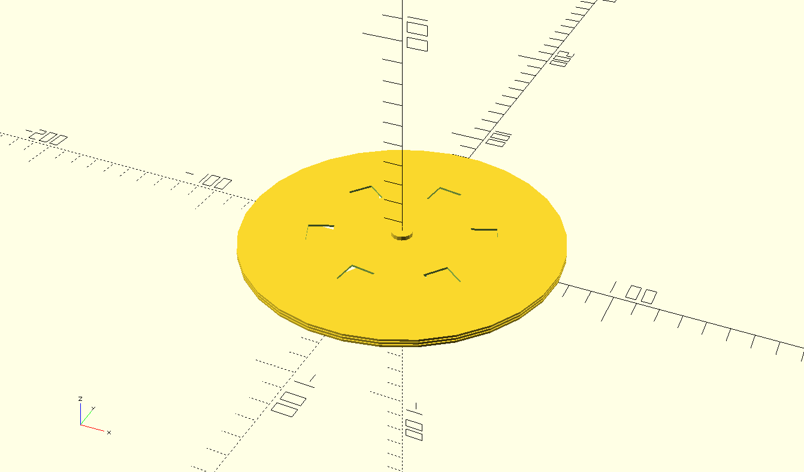

# AirBox - An Attachment for a Kelly Kettle that Turns it Into an Air Fryer

This repo contains a few OpenSCAD concept models for a device I thought would be interesting to attach to a Kelly Kettle, turning it into a self-regulating "hot air box" oven with features similar to an Air Fryer: contained constant-temperature fire flow suitable for cooking.

## Why?

Well, just as a thought experiment, really. The Kelly Kettle is a perfectly functional cooking device as it is—you just need the correct pan/pot/container setup for it, and you can attain results that even exceed those of your average kitchen Air Fryer.

However, the thought experiment is more along the lines of: *"How can the Kelly Kettle be used as an energy source for other things?"* The desire to have a wood-fired, regulated-temperature air box also stems from the fact that flow ovens are handy for repairing electronics, too.

So, there will be more of that thought experimenting and less of the *"Is this really practical?"* kind of thing going on in this repo.

## TODO

1. **Basic OpenSCAD models:** ✅  
2. **Simulation**  
3. **Parameterization**  
4. **ML techniques**  

## Materials

- 3D-printed ceramics would be nice.  
- Models targeting flat sheet steel (easy to human-manufacture) should also be demonstrated.  

## References
- Kelly Kettle: https://www.kellykettle.com/eu/accessories

## Screenshots

